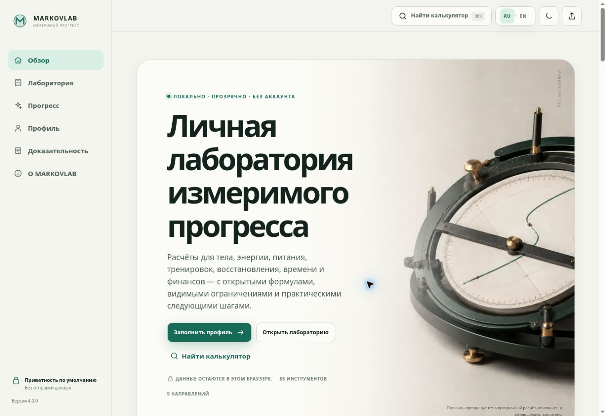

# MARKOVLAB 5.3

MARKOVLAB — двуязычная персональная лаборатория измеримого прогресса: 86 прозрачных калькуляторов в 9 направлениях, reusable‑профиль, история, снимки, динамика, доказательный контекст и практические следующие шаги.

> Вопрос → ввод → расчёт → значение → основание → неопределённость → ограничение → действие → история → динамика.



Продукт работает без аккаунта и backend: профиль, избранное, история и настройки остаются в браузере. Удалённые шрифты, analytics, trackers и обязательные runtime API отсутствуют.

## Что входит в 5.3

- 86 стабильных calculator ID и 9 лабораторий: тело, энергия, питание, сила, кардио, восстановление, фокус, финансы и конвертеры; Body включает provenance-backed fat-equivalent model.
- Natural-language поиск с RU/EN aliases, опечатками и intent‑запросами вроде «сколько калорий мне есть» или “inflation adjusted return”.
- Search-first shell без постоянного sidebar и блокирующего onboarding; Home сразу ведёт к первому полезному измерению.
- Compact calculator decision surface: число, смысл, limitation, action и save доступны в одном рабочем контексте; Evidence и Formula раскрываются отдельно.
- Плотная библиотека: практические starting points, 9 лабораторий и компактные строки инструментов вместо стены одинаковых карточек.
- Русская и английская версии без смешанного интерфейса; locale‑форматирование чисел и дат.
- Light, Paper, Dark и Midnight как четыре разные палитры; System следует ОС и инициализируется без flash неправильной темы.
- Basic / Pro на всех 86 страницах: полный input protocol и sensitivity stress test со сравнением Scenario A/B; Pro controls are native buttons with pointer-event tracing and keyboard support.
- Лаборатория различает Recommended, All 86 и Favorites; внутренние editorial routes проверяются по registry.
- Inventory-aware plate loader показывает exact/nearest lower/nearest upper, achieved total и разницу с целью.
- Профиль с объяснённым ROI, персональная главная, избранное, history, snapshots и честные SVG‑графики без выдуманного сглаживания.
- Versioned export/import, v1/v2/v3→v4 migration, canonical structured history with locale-at-render, bounded import и защита от prototype pollution.
- Installable PWA, offline app shell, update lifecycle, print‑report и branded 404.
- Новая logo system `M + calibration + reference point`, смысловая evidence-визуализация и локальная серия оптимизированных WebP/SVG assets.
- Шесть локальных **путей решения**: энергия и белок, состав тела, рабочий вес, беговой ориентир, восстановление и финансовый runway. Путь показывает прогресс, сохраняет контекст в сессии и переносит только те результаты, чьи единицы и смысл совпадают.
- Ранний bootstrap теперь читает актуальное state v4: выбранные язык и тема применяются до первого рендера, а PWA получает новый cache revision.

## Запуск

Нужен Node.js 18+ только для локального HTTP‑сервера и тестов. Сам продукт — статическое приложение без сборки.

```bash
npm run dev
```

Не открывайте `index.html` через `file://`: ES modules и service worker требуют HTTP(S).

## Quality gate

```bash
npm test
npm run docs:matrix
```

Автоматические проверки покрывают formulas, registry 86/86, Basic/Pro surfaces, routes/render, RU/EN parity, natural-language search, storage/import/migration, PWA, manifests, themes bootstrap, cache-safe runtime assets, content completeness и отсутствие remote runtime dependencies.

## Архитектура

- `index.html`, `404.html` — shell и GitHub Pages fallback;
- `assets/js/` — registry, formulas, router, state/storage, search, i18n, renderers и PWA lifecycle;
- `assets/css/` — tokens, components, themes, responsive и print layers;
- `assets/brand/`, `assets/images/`, `assets/icons/` — logo system, art direction и PWA assets;
- `data/` — переносимые каталоги калькуляторов и источников;
- `tests/` — release gate и responsive visual harness;
- `docs/` — product, evidence, formula, brand, QA и release documentation.

## Deployment

GitHub Pages публикуется workflow `deploy-pages.yml` из `main`. Все runtime‑пути относительные, маршрутизация hash‑based, production canonical — `https://castefeudal.github.io/markovlab/`.

## Документация

- [Product spec](docs/PRODUCT_SPEC.md)
- [Design & UX](docs/DESIGN_UX.md)
- [Brand system](docs/BRAND_SYSTEM.md)
- [Evidence & safety](docs/EVIDENCE.md)
- [Formulas](docs/FORMULAS.md)
- [Content completeness 86/86](docs/CONTENT_COMPLETENESS_MATRIX.md)
- [Visual QA matrix](docs/VISUAL_QA_MATRIX.md)
- [QA report](docs/QA_REPORT.md)
- [MARKOVLAB 5X report](docs/MARKOVLAB_5X_REPORT.md)
- [Release notes 5.0.0](docs/RELEASE_NOTES_5.0.0.md)
- [Release notes 5.1.0](docs/RELEASE_NOTES_5.1.0.md)
- [Шлифовочный production-промт 9.5+](docs/MARKOVLAB_95_POLISH_PROMPT.md)
- [Targeted polish report](docs/MARKOVLAB_TARGETED_POLISH_REPORT.md)
- [Fat-gain model provenance](docs/FAT_GAIN_MODEL_PROVENANCE.md)
- [Overlay theme contract](docs/OVERLAY_THEME_CONTRACT.md)
- [Editorial copy review](docs/EDITORIAL_COPY_REVIEW.md)
- [Production completion report](docs/MARKOVLAB_FINAL_CORRECTIVE_REPORT.md)
- [Calculator coverage roadmap](docs/CALCULATOR_COVERAGE_ROADMAP.md)

Версия: **5.3.0**.
